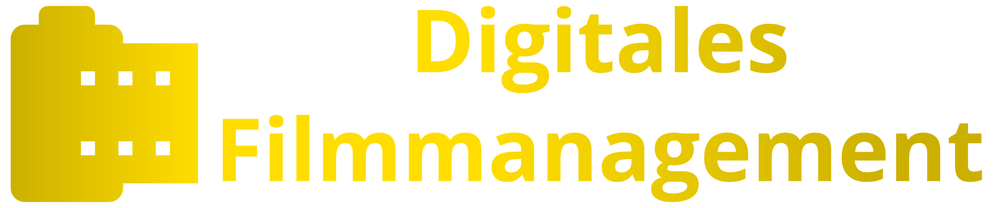

<div align="center">
<object style="max-height: 1.75rem;" type="image/svg+xml" data="img/logo.svg">
    
</object>
<hr/>


</div>

## ⚠️ Important Notice
This branch only contains some basic mock ups which contains **no functionality**
or actual data.


## 📖 About
This web application was created with the aim of making the management of movie screenings easier. 
The application is designed to be used by the employees of the [Unikino Gegenlicht](https://gegenlicht.net/).
The application is written in [TypeScript](https://www.typescriptlang.org/) and uses [React](https://reactjs.org/) as a framework.

## 📦 Installation
To use the mockup in a more efficient manner you can follow the steps listed
below:
1. Install a current version of [Node.js](https://nodejs.org)
2. Clone the repository to your machine
    ```bash
    git clone https://github.com/unikino-gegenlicht/digitales-filmmanagement.git
    ```
    and checkout the `mockups` branch
    ```bash
    git checkout mockups
    ```
3. Install the needed packages for the mockup via `pnmp`
    ```bash
    # (optional, if not already installed) install pnpm
    npm install -g pnpm
    # Install the needed packages
    pnpm install
    ```
4. Startup the mockup
    ```bash
    npm start
    ```

The mockups should now be available via [localhost:3000](http://localhost:3000)

## 📝 License
This project is licensed under the MIT License — see the [LICENSE](LICENSE) file for details.