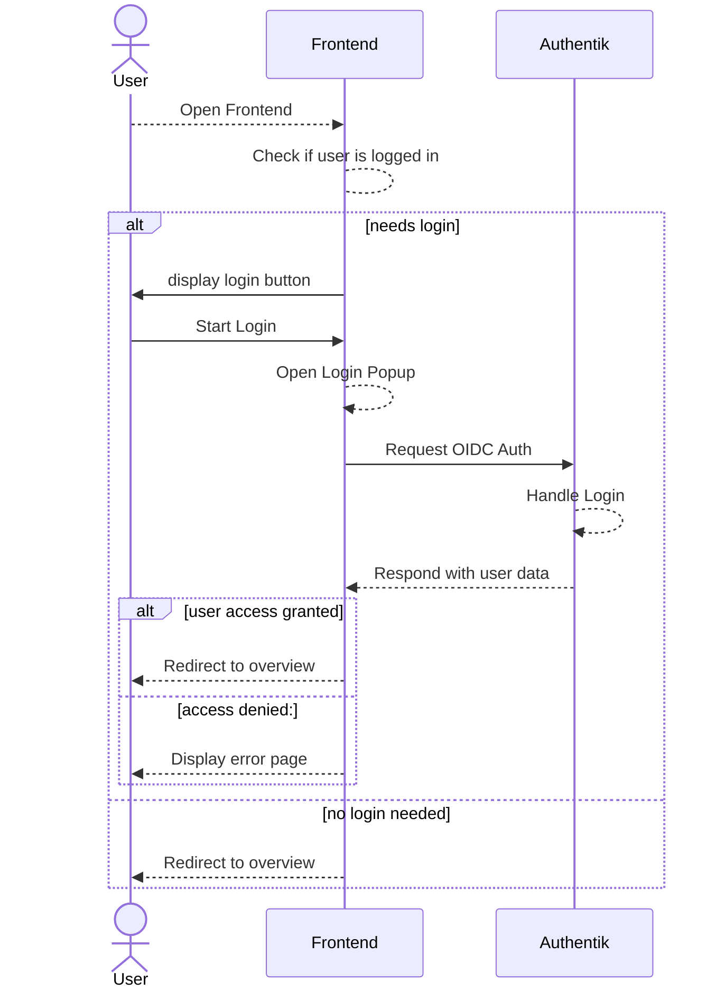

# Login Mockup
## User Flow

```mermaid
sequenceDiagram

actor U as User
participant f as Frontend
participant a as Authentik


U-->>f: Open Frontend
f-->f: Check if user is logged in
alt needs login
    f->>U: display login button
    U->>f: Start Login
    f-->>f: Open Login Popup
    f->>a: Request OIDC Auth
    a-->>a: Handle Login
    a-->>f: Respond with user data
    alt user access granted
        f-->>U: Redirect to overview
    else access denied:
        f-->>U: Display error page
    end
else no login needed
    f-->>U: Redirect to overview
end

```